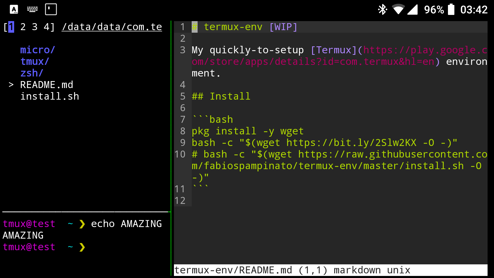

# termux-env

<p align="center">
  
</p>

My super-quick-to-setup [Termux](https://play.google.com/store/apps/details?id=com.termux&hl=en) environment.

## Install

```bash
pkg install -y wget
bash -c "$(wget https://bit.ly/2Slw2KX -O -)"
# bash -c "$(wget https://raw.githubusercontent.com/fabiospampinato/termux-env/master/install.sh -O -)"
```

## Tips

- **Immersive mode**: it might be a good idea to force Termux to go fullscreen, in order to have more screen real estate:
  - **Enable**: `adb shell settings put global policy_control immersive.full=com.termux`
  - **Disable**: `adb shell settings put global policy_control immersive.off=com.termux`
